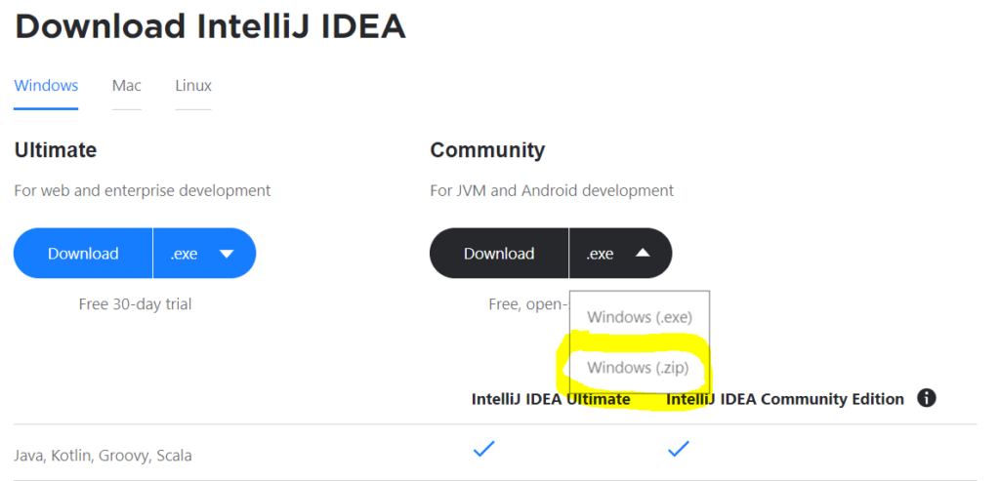
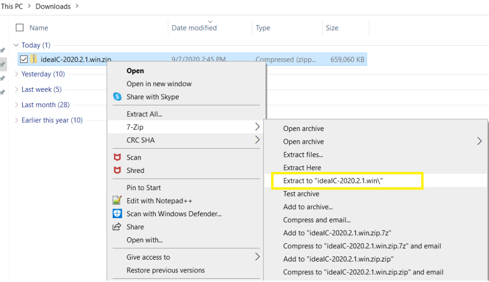
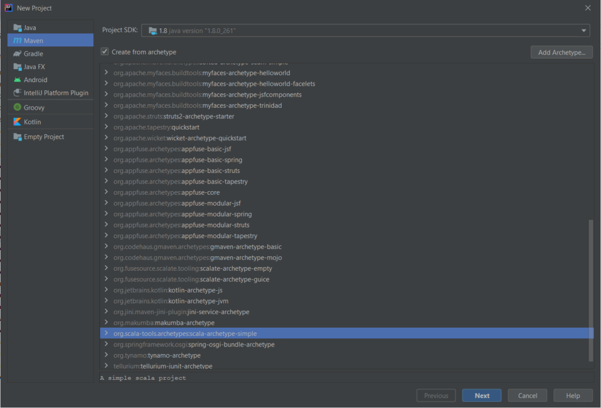
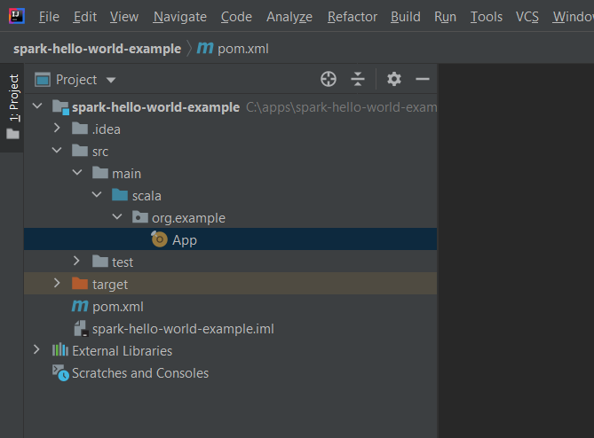
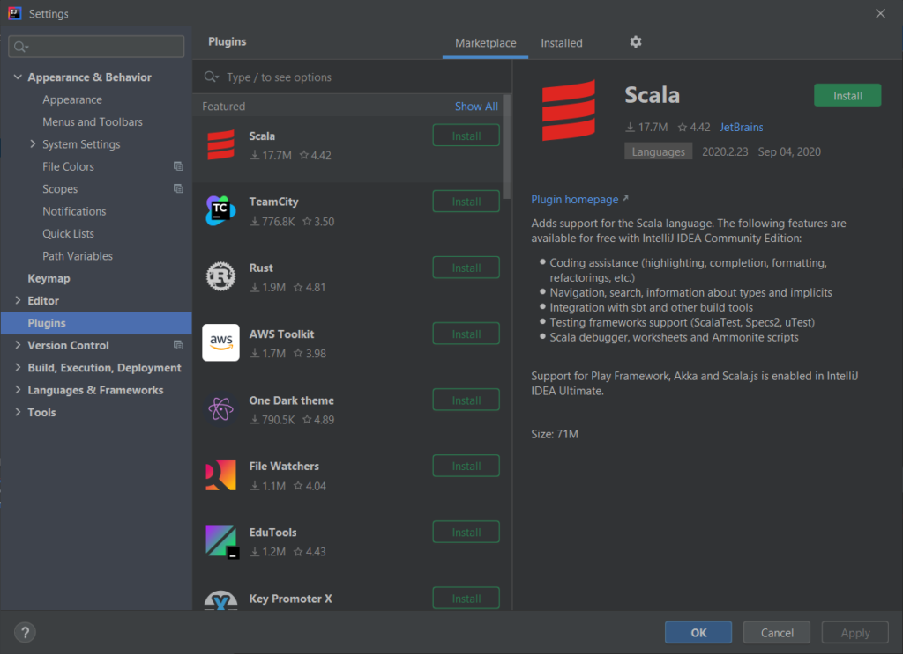
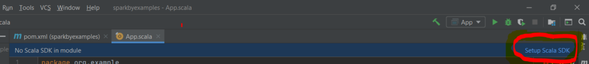
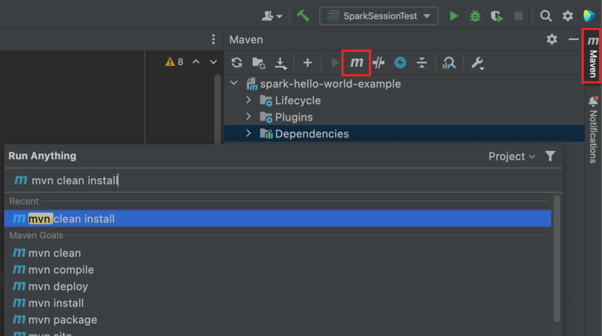
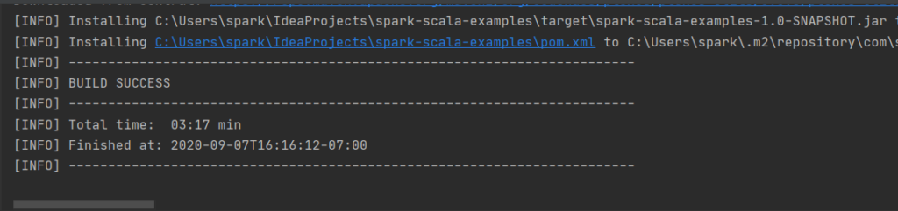

Spark Setup with Scala and Run in IntelliJ
==========================================


IntelliJ IDEA is the most used IDE to run Spark applications written in
Scala due to its good Scala code completion. In this article, I will
explain how to setup and run an Apache Spark application written in
Scala using Apache Maven with IntelliJ IDEA.


1. Install JDK
-----------------------------------------------------------------------

You might be aware that Spark was created in Scala language and Scala is
a JVM language that needs JVM to run hence, to compile & execute Spark
applications you need to have Java installed on your system.

Download and Install Java 8 or above from
[Oracle.com](https://www.java.com/en/download/)


2. Setup IntelliJ IDEA for Spark
-----------------------------------------------------------------------------------------------------------

Most of the Spark engineers use IntelliJ IDEA to run Spark applications
written in Scala due to its good Scala compatibility hence, It's better
to have a development environment setup using IntelliJ.

IntelliJ IDEA comes with a community & ultimate edition, In order to run
the Spark application written in Scala, the community edition is just
enough for us, so download [IntelliJ IDEA community
edition](https://www.jetbrains.com/idea/download/#section=windows).

1.  You can either download the **windows installer(.exe)** or as a
    compressed **zip (.zip)** file based on your convenience. I've
    downloaded the .zip file.



2\. Now, let's unzip either using
[Winzip](https://www.winzip.com/win/en/),
[7-Zip](https://www.7-zip.org/), or any other zip extracts you have.
I've used 7-Zip to extract the contents to the folder.




3\. Move the extracted folder from Downloads to your working folder. In
my case, I am moving it to `c:\apps\`.

4\. Start IntelliJ IDE by running `idea64.exe` from
`C:\apps\ideaIC-2020.2.1.win\bin\idea64.exe`

3. Create a Scala project In IntelliJ
---------------------------------------------------------------------------------------------------------------------

After starting an IntelliJ IDEA IDE, you will get a Welcome screen with
different options.


1.  Select **New Project** to open the new project window.



2\. Select **Maven** from the left panel

3\. Check option **Create from archetype**

4\. Select **org.scala-tools.archetypes:scala-archetypes-simple**.

-   The archetype is a kind of template that creates the right directory
    structure and downloads the required default dependencies. Since we
    have selected Scala archetypes, it downloads all Scala dependencies
    and enables IntelliJ to write Scala code.

5\. In the next window, enter the project name. I am naming my project
**spark-hello-world-example**.

6\. On the next screen, review the options for artifact-id and group-id

7\. Select **Finish**.

This creates a project on IntelliJ and shows the following project
structure on the left **Project** panel. (you need to expand the project
until you see `App.scala` file.



4. Install Scala Plugin
-----------------------------------------------------------------------------------------

Now navigate to

1.  Open **File** \> **Settings** (or using shot keys Ctrl + Alt + s ) .
    On **macOS** use **IntellijIDEA -\> Preferences**
2.  Select the **Plugins** option from the left panel. This brings you
    to the **Feature** panel.
3.  Click on **Install** to install the Scala plugin.



4\. After plugin installation, restart the IntelliJ IDE.

5. Setup Scala SDK
-------------------------------------------------------------------------------

1\. After restart, IntelliJ will prompt you as shown below to Setup
Scala SDK. If this doesn't show up then You can add Scala SDK as a
global library for your project in \`**Project Settings \[F4\] -\>
Platform Settings / Global Libraries -\> Add -\> Scala SDK** -\>
**Download**\`



2\. Select **Setup Scala SDK**, it prompts you to the below window,

3\. Select the **create** option.


4\. From the next window select the **Download** option and

5\. Choose Scala version 2.13.0 (latest at the time of writing this
article)

6. Make changes to pom.xml file
--------------------------------------------------------------------------------------------------------

Now, we need to make some changes to the pom.xml file, you can either
follow the below instructions or download the pom.xml file GitHub
project and replace it with your pom.xml file.

1\. First, change the Scala version to the latest version, I am using
2.13.0

```
 <properties>
    <scala.version>2.13.0</scala.version>
 </properties>
```


2\. Remove the following plugin

```
      <plugin>
        <groupId>org.scala-tools</groupId>
        <artifactId>maven-scala-plugin</artifactId>
        <executions>
          <execution>
            <goals>
              <goal>compile</goal>
              <goal>testCompile</goal>
            </goals>
          </execution>
        </executions>
        <configuration>
          <scalaVersion>${scala.version}</scalaVersion>
          <args>
            <arg>-target:jvm-1.5</arg>
          </args>
        </configuration>
      </plugin>
```


3\. Delete the following line.

```
<testSourceDirectory>src/test/scala</testSourceDirectory>
```


7. Delete Unnecessary Files
-------------------------------------------------------------------------------------------------

Now delete the following from the project workspace.

1.  Delete src/test
2.  Delete src/main/scala/org.example.App

{.wp-image-8776
.lazyload width="843" height="694"}

8. Add Spark Dependencies to Maven pom.xml File
----------------------------------------------------------------------------------------------------------------------------------------

Add Spark dependencies to **pom.xml** file

```
    <dependency>
      <groupId>org.apache.spark</groupId>
      <artifactId>spark-core_2.13</artifactId>
      <version>3.2.1</version>
      <scope>compile</scope>
    </dependency>

    <dependency>
      <groupId>org.apache.spark</groupId>
      <artifactId>spark-sql_2.13</artifactId>
      <version>3.2.1</version>
      <scope>compile</scope>
    </dependency>
```


9. Create Spark Hello world Application on IntelliJ
-------------------------------------------------------------------------------------------------------------------------------------------------

1\. Now create the Scala class **SparkSessionTest** program, I will
treat this as a Hello World Program for Spark. Our hello world example
doesn't display "Hello World" text instead it creates a SparkSession and
displays the Spark app name, master, and deployment mode to the console.

```
package org.example
import org.apache.spark.sql.SparkSession
object SparkSessionTest extends App{
    val spark = SparkSession.builder()
      .master("local[1]")
      .appName("SparkByExample")
      .getOrCreate();
    
    println("First SparkContext:")
    println("APP Name :"+spark.sparkContext.appName);
    println("Deploy Mode :"+spark.sparkContext.deployMode);
    println("Master :"+spark.sparkContext.master);

    val sparkSession2 = SparkSession.builder()
      .master("local[1]")
      .appName("SparkByExample-test")
      .getOrCreate();

    println("Second SparkContext:")
    println("APP Name :"+sparkSession2.sparkContext.appName);
    println("Deploy Mode :"+sparkSession2.sparkContext.deployMode);
    println("Master :"+sparkSession2.sparkContext.master);
}
```


2\. Sometimes the dependencies in pom.xml are not automatically loaded
hence, re-import the dependencies or restart the IntelliJ.

3\. Run the Maven build.

Select **Maven** from the right top corner, select **M**, and type or
select **mvn clean install**.



This Installs all Maven dependencies and builds your project. Finally,
you should see **BUILD SUCCESS** as below.



4\. Now run the Spark application **SparkSessionTest** program.

5\. This should display the below output on the console. In case you
still get errors during the running of the Spark application, please
restart the IntelliJ IDE and run the application again. Now you should
see the below message in the console.

{.wp-image-8747
.lazyload width="1024" height="279"}

