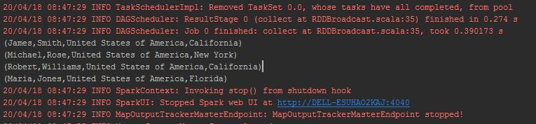
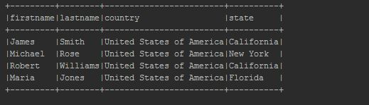

Spark Broadcast Variables
=========================


In Spark RDD and DataFrame, Broadcast variables are read-only shared
variables that are cached and available on all nodes in a cluster
in-order to access or use by the tasks. Instead of sending this data
along with every task, spark distributes broadcast variables to the
machine using efficient broadcast algorithms to reduce communication
costs.

### Use case

Let me explain with an example, assume you are getting a two-letter
country state code in a file and you wanted to transform it to full
state name, (for example CA to California, NY to New York e.t.c) by
doing a lookup to reference mapping. In some instances, this data could
be large and you may have many such lookups (like zip code).


Instead of distributing this information along with each task over the
network (overhead and time consuming), we can use the broadcast variable
to cache this lookup info on each machine and tasks use this cached info
while executing the transformations.

How does Spark Broadcast work?
-------------------------------------------------------------------------------------------------------

Broadcast variables are used in the same way for RDD, DataFrame, and
Dataset.


When you run a Spark RDD, DataFrame jobs that has the Broadcast
variables defined and used, Spark does the following.

-   Spark breaks the job into stages that have distributed shuffling and
    actions are executed with in the stage.
-   Later Stages are also broken into tasks
-   Spark broadcasts the common data (reusable) needed by tasks within
    each stage.
-   The broadcasted data is cache in serialized format and deserialized
    before executing each task.

You should be creating and using broadcast variables for data that
shared across multiple stages and tasks.

Note that broadcast variables are not sent to executors with
sc.broadcast(variable) call instead, they will be sent to executors when
they are first used.


How to create Broadcast variable
------------------------------------------------------------------------------------------------------------

The Spark Broadcast is created using the `broadcast(v)` method of the
SparkContext class. This method takes the argument v that you want to
broadcast.

### In Spark shell

```
scala> val broadcastVar = sc.broadcast(Array(0, 1, 2, 3))
broadcastVar: org.apache.spark.broadcast.Broadcast[Array[Int]] = Broadcast(0)

scala> broadcastVar.value
res0: Array[Int] = Array(0, 1, 2, 3)
```


Spark RDD Broadcast variable example
--------------------------------------------------------------------------------------------------------------------

Below is a very simple example of how to use broadcast variables on RDD.
This example defines commonly used data (country and states) in a Map
variable and distributes the variable using `SparkContext.broadcast()`
and then use these variables on RDD map() transformation.

```
import org.apache.spark.sql.SparkSession

object RDDBroadcast extends App {

  val spark = SparkSession.builder()
    .appName("sparkexamples")
    .master("local")
    .getOrCreate()

  val states = Map(("NY","New York"),("CA","California"),("FL","Florida"))
  val countries = Map(("USA","United States of America"),("IN","India"))

  val broadcastStates = spark.sparkContext.broadcast(states)
  val broadcastCountries = spark.sparkContext.broadcast(countries)

  val data = Seq(("James","Smith","USA","CA"),
    ("Michael","Rose","USA","NY"),
    ("Robert","Williams","USA","CA"),
    ("Maria","Jones","USA","FL")
  )

  val rdd = spark.sparkContext.parallelize(data)

  val rdd2 = rdd.map(f=>{
    val country = f._3
    val state = f._4
    val fullCountry = broadcastCountries.value.get(country).get
    val fullState = broadcastStates.value.get(state).get
    (f._1,f._2,fullCountry,fullState)
  })

  println(rdd2.collect().mkString("\n"))

}
```


Yields below output



Spark DataFrame Broadcast variable example
--------------------------------------------------------------------------------------------------------------------------------

Below is an example of how to use broadcast variables on DataFrame.
similar to above RDD example, This defines commonly used data (country
and states) in a Map variable and distributes the variable using
`SparkContext.broadcast()` and then use these variables on DataFrame
map() transformation.

```
import org.apache.spark.sql.SparkSession

object BroadcastExample extends App{

  val spark = SparkSession.builder()
    .appName("sparkexamples")
    .master("local")
    .getOrCreate()

  val states = Map(("NY","New York"),("CA","California"),("FL","Florida"))
  val countries = Map(("USA","United States of America"),("IN","India"))

  val broadcastStates = spark.sparkContext.broadcast(states)
  val broadcastCountries = spark.sparkContext.broadcast(countries)

  val data = Seq(("James","Smith","USA","CA"),
    ("Michael","Rose","USA","NY"),
    ("Robert","Williams","USA","CA"),
    ("Maria","Jones","USA","FL")
  )

  val columns = Seq("firstname","lastname","country","state")
  import spark.sqlContext.implicits._
  val df = data.toDF(columns:_*)

  val df2 = df.map(row=>{
    val country = row.getString(2)
    val state = row.getString(3)

    val fullCountry = broadcastCountries.value.get(country).get
    val fullState = broadcastStates.value.get(state).get
    (row.getString(0),row.getString(1),fullCountry,fullState)
  }).toDF(columns:_*)

  df2.show(false)
}
```


Above example first [creates a DataFrame],
transform the data using broadcast variable and yields below output.



### Conclusion

In this Spark Broadcast variable lab you have learned what is
Broadcast variable, it's advantage and how to use in RDD and Dataframe
with scala example.

