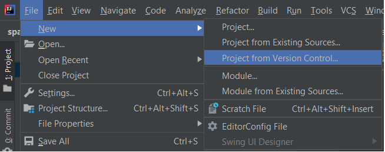
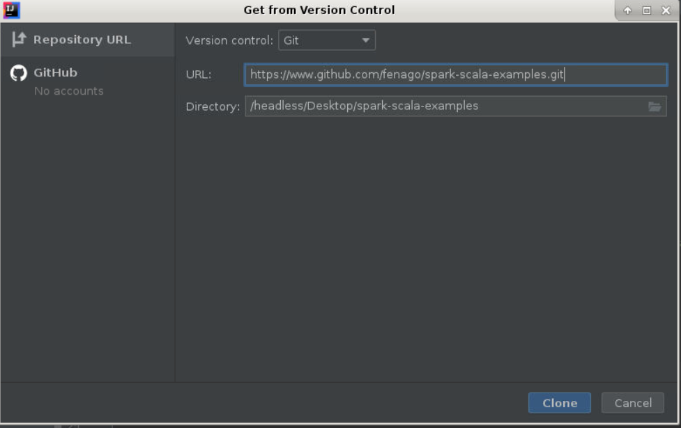
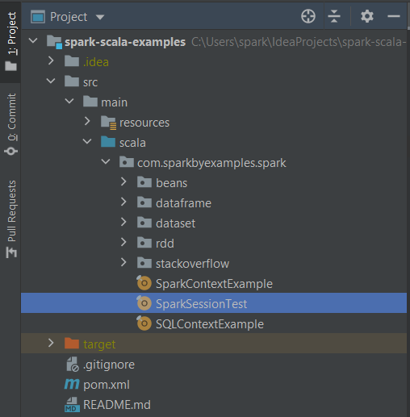
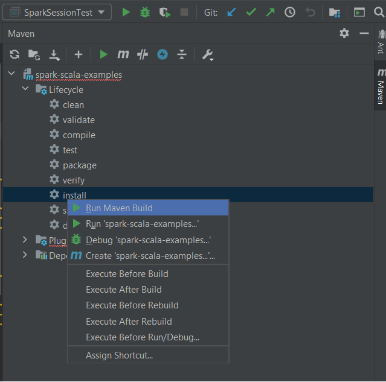

How to Run Spark Examples from IntelliJ
=======================================


Here, I will explain how to run Apache Spark Application examples
explained in this **blog** on windows using Scala & Maven from IntelliJ
IDEA. Since the articles mentioned in this tutorial uses Apache Maven as
the build system, we will use [Maven](https://maven.apache.org/) to
build the project.

Make sure you have the following before you proceed.


-   [IntelliJ IDE Setup and run Spark Application with Scala on
    Windows]

Clone Spark Examples GitHub Project into IntelliJ
-------------------------------------------------

Let's clone [Spark By Examples Github
project](https://github.com/fenago/spark-scala-examples) into
IntelliJ by using the Version Control option.

-   Open IntelliJ IDEA
-   Create a new project by selecting **File** \> **New** \> **Project
    from Version Control**.



Using this option, we are going to import the project directly from
GitHub repository.




-   On **Get from Version Control** window, select the Version control
    as **Git** and enter the below Github URL for **URL** and enter the
    directory where you wanted to clone.

```
https://github.com/fenago/spark-scala-examples.git
```


-   If you don't have **Git** installed, select the "**Download and
    Install" option from the** above window.
-   After Git installation, select the **clone** option which clones the
    project into your given folder.
-   This creates a new project on IntelliJ and starts cloning.
-   Now, wait for a few mins to complete the clone and also import the
    project into the workspace.

Once the cloning completes, you will see the following project workspace
structure on IntelliJ.



Run Maven build
---------------

Now run the Maven build. First, select the **Maven** from the right
corner, navigate to **Lifecycle** \> **install**, right-click, and
select **Run Maven Build**.



This downloads all dependencies mentioned in the pom.xml file and
compiles all examples in this tutorial. This also takes a few mins to
complete and you should see the below message after a successful build.


Run Spark Program From IntelliJ
-------------------------------

After successful Maven build, run
`src/main/scala/com.sparkbyexamples.spark.SparkSessionTest` example from
IntelliJ.

In case if you still get errors during the running of the Spark
application, please restart the IntelliJ IDE and run the application
again. Now you should see the below message in the console.


Once you complete the running Spark sample example in IntelliJ, you
should read [what is Spark
Session],
[what is Spark
Context], [Spark
RDD], [Spark RDD
Actions],
[Spark RDD
Transformations].

