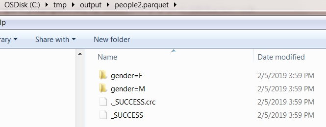

Spark Read and Write Apache Parquet
===================================


Apache Parquet Introduction
--------------------------------------------------------------------------------------------------

[Apache Parquet](https://parquet.apache.org/) is a columnar file format
that provides optimizations to speed up queries and is a far more
efficient file format than CSV or JSON, supported by many data
processing systems.

It is compatible with most of the data processing frameworks in
the [Hadoop](https://en.wikipedia.org/wiki/Hadoop) echo systems. It
provides efficient data compression and encoding schemes with enhanced
performance to handle complex data in bulk.


Spark SQL provides support for both reading and writing Parquet files
that automatically capture the schema of the original data, It also
reduces data storage by 75% on average. Below are some advantages of
storing data in a parquet format. Spark by default supports Parquet in
its library hence we don't need to add any dependency libraries.

Apache Parquet Advantages:
-----------------------------------------------------------------------------------------------

Below are some of the advantages of using Apache Parquet. combining
these benefits with Spark improves performance and gives the ability to
work with structure files.

-   **Reduces IO operations.**
-   **Fetches specific columns that you need to access.**
-   **It consumes less space.**
-   **Support type-specific encoding.**

Apache Parquet Spark Example
----------------------------------------------------------------------------------------------------

Before we go over the Apache parquet with the Spark example, first,
let's [Create a Spark
DataFrame]
from `Seq` object. Note that
[toDF()]
function on sequence object is available only when you import implicits
using `spark.sqlContext.implicits._`. This complete spark parquet
example is available at
[Github](https://github.com/sparkbyexamples/spark-examples/blob/master/spark-sql-examples/src/main/scala/com/sparkbyexamples/spark/dataframe/ParquetExample.scala)
repository for reference.


```
val data = Seq(("James ","","Smith","36636","M",3000),
              ("Michael ","Rose","","40288","M",4000),
              ("Robert ","","Williams","42114","M",4000),
              ("Maria ","Anne","Jones","39192","F",4000),
              ("Jen","Mary","Brown","","F",-1))

val columns = Seq("firstname","middlename","lastname","dob","gender","salary")

import spark.sqlContext.implicits._
val df = data.toDF(columns:_*)
```


The above example creates a data frame with columns "firstname",
"middlename", "lastname", "dob", "gender", "salary"

### Spark Write DataFrame to Parquet file format

Using `parquet()` function of `DataFrameWriter` class, we can write
Spark DataFrame to the Parquet file. As mentioned earlier Spark doesn't
need any additional packages or libraries to use Parquet as it by
default provides with Spark. easy isn't it? so we don't have to worry
about version and compatibility issues. In this example, we are writing
DataFrame to "people.parquet" file.

```
df.write.parquet("/tmp/output/people.parquet")
```


Writing Spark DataFrame to Parquet format preserves the column names and
data types, and all columns are automatically converted to be nullable
for compatibility reasons. Notice that all part files Spark creates has
parquet extension.


### Spark Read Parquet file into DataFrame

Similar to write, DataFrameReader provides parquet() function
(spark.read.parquet) to read the parquet files and creates a Spark
DataFrame. In this example snippet, we are reading data from an apache
parquet file we have written before.

```
val parqDF = spark.read.parquet("/tmp/output/people.parquet")
```


printing schema of DataFrame returns columns with the same names and
data types.

### Append to existing Parquet file

Spark provides the capability to append DataFrame to existing parquet
files using "append" save mode. In case, if you want to overwrite use
"overwrite" save mode.

```
df.write.mode('append').parquet("/tmp/output/people.parquet")
```


### Using SQL queries on Parquet

We can also create a temporary view on Parquet files and then use it in
Spark SQL statements. This temporary table would be available until the
SparkContext present.

```
parqDF.createOrReplaceTempView("ParquetTable")
val parkSQL = spark.sql("select * from ParquetTable where salary >= 4000 ")
```


Above predicate on spark parquet file does the file scan which is
performance bottleneck like table scan on a traditional database. We
should use partitioning in order to improve performance.

Spark parquet partition -- Improving performance
-------------------------------------------------------------------------------------------------------------------------------------------

Partitioning is a feature of many databases and data processing
frameworks and it is key to make jobs work at scale. We can do a parquet
file partition using spark `partitionBy()` function.

```
df.write.partitionBy("gender","salary")
        .parquet("/tmp/output/people2.parquet")
```


Parquet Partition creates a folder hierarchy for each spark partition;
we have mentioned the first partition as gender followed by salary
hence, it creates a salary folder inside the gender folder.



This is an example of how to write a Spark DataFrame by preserving the
partitioning on gender and salary columns.

```
val parqDF = spark.read.parquet("/tmp/output/people2.parquet")
parqDF.createOrReplaceTempView("Table2")
val df = spark.sql("select * from Table2  where gender='M' and salary >= 4000")
```


The execution of this query is [significantly faster than the query
without
partition].
It filters the data first on gender and then applies filters on salary.

Spark Read a specific Parquet partition
--------------------------------------------------------------------------------------------------------------------------

```
val parqDF = spark.read.parquet("/tmp/output/people2.parquet/gender=M")
```


This code snippet retrieves the data from the gender partition value
"M".

The complete code can be downloaded
from [GitHub](https://github.com/sparkbyexamples/spark-examples/blob/master/spark-sql-examples/src/main/scala/com/sparkbyexamples/spark/dataframe/ParquetExample.scala)

Complete Spark Parquet Example
--------------------------------------------------------------------------------------------------------

```
package com.sparkbyexamples.spark.dataframe

import org.apache.spark.sql.SparkSession

object ParquetExample {

  def main(args:Array[String]):Unit= {

    val spark: SparkSession = SparkSession.builder()
      .master("local[1]")
      .appName("sparkexamples")
      .getOrCreate()

    val data = Seq(("James ","","Smith","36636","M",3000),
                 ("Michael ","Rose","","40288","M",4000),
                 ("Robert ","","Williams","42114","M",4000),
                 ("Maria ","Anne","Jones","39192","F",4000),
                 ("Jen","Mary","Brown","","F",-1))

    val columns = Seq("firstname","middlename","lastname","dob","gender","salary")
    import spark.sqlContext.implicits._
    val df = data.toDF(columns:_*)
    df.show()
    df.printSchema()
    df.write
      .parquet("/tmp/output/people.parquet")
    val parqDF = spark.read.parquet("/tmp/output/people.parquet")
    parqDF.createOrReplaceTempView("ParquetTable")
    spark.sql("select * from ParquetTable where salary >= 4000").explain()
    val parkSQL = spark.sql("select * from ParquetTable where salary >= 4000 ")
    parkSQL.show()
    parkSQL.printSchema()
    df.write
      .partitionBy("gender","salary")
      .parquet("/tmp/output/people2.parquet")
    val parqDF2 = spark.read.parquet("/tmp/output/people2.parquet")
    parqDF2.createOrReplaceTempView("ParquetTable2")
    val df3 = spark.sql("select * from ParquetTable2  where gender='M' and salary >= 4000")
    df3.explain()
    df3.printSchema()
    df3.show()
    val parqDF3 = spark.read
      .parquet("/tmp/output/people2.parquet/gender=M")
    parqDF3.show()
  }
}
```


#### Conclusion:

You have learned how to read a write an apache parquet data files in
Spark and also learned [how to improve the
performance]
by using partition and filtering data with a partition key and finally
appending to and overwriting existing parquet files.

