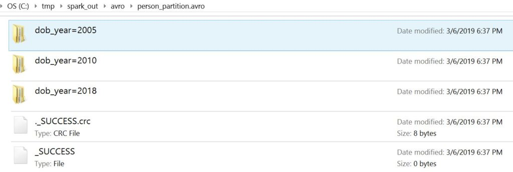

Read & Write Avro files using Spark DataFrame
=============================================


**Related:** [Spark from\_avro() and to\_avro()
usage]

What is Apache Avro?
-----------------------------------------------------------------------------------

[Apache Avro](https://avro.apache.org/docs/current/) is an open-source,
row-based, data serialization and data exchange framework for Hadoop
projects, originally developed by databricks as an open-source library
that supports reading and writing data in Avro file format. it is mostly
used in Apache Spark especially for Kafka-based data pipelines. When
Avro data is stored in a file, its schema is stored with it, so that
files may be processed later by any program.

It has build to serialize and exchange big data between different Hadoop
based projects. It serializes data in a compact binary format and schema
is in JSON format that defines the field names and data types.


It is similar
to [Thrift](https://en.wikipedia.org/wiki/Thrift_(protocol)) and [Protocol
Buffers](https://en.wikipedia.org/wiki/Protocol_Buffers), but does not
require the code generation as it's data always accompanied by a schema
that permits full processing of that data without code generation. This
is one of the great advantages compared with other serialization
systems.

Apache Avro Advantages
----------------------------------------------------------------------------------------

-   Supports complex data structures like Arrays, Map, Array of map and
    map of array elements.
-   A compact, binary serialization format which provides fast while
    transferring data.
-   row-based data serialization system.
-   Support multi-languages, meaning data written by one language can be
    read by different languages.
-   Code generation is not required to read or write data files.
-   Simple integration with dynamic languages.

Spark Avro dependencies
------------------------------------------------------------------------------------------

Since Spark 2.4, [Spark
SQL](https://spark.apache.org/docs/latest/sql-programming-guide.html) provides
built-in support for reading and writing Apache Avro data files,
however, the `spark-avro` module is external and by default, it's not
included in `spark-submit` or `spark-shell` hence, accessing Avro file
format in Spark is enabled by providing a package.

#### maven dependencies.

```
<dependency>
    <groupId>org.apache.spark</groupId>
    <artifactId>spark-avro_2.11</artifactId>
    <version>2.4.0</version>
</dependency>
```

#### spark-submit

While using `spark-submit`, provide `spark-avro_2.12` and its
dependencies directly using `--packages`, such as,

```
./bin/spark-submit --packages org.apache.spark:spark-avro_2.12:2.4.4
```


#### spark-shell

While working with  `spark-shell`, you can also use `--packages` to
add `spark-avro_2.12` and its dependencies directly,

```
./bin/spark-shell --packages org.apache.spark:spark-avro_2.12:2.4.4
```


Write Spark DataFrame to Avro Data File
--------------------------------------------------------------------------------------------------------------------------

Since Avro library is external to Spark, it doesn't provide `avro()`
function on `DataFrameWriter` , hence we should use DataSource "`avro`"
or "`org.apache.spark.sql.avro`" to write Spark DataFrame to Avro file.

```
df.write.format("avro").save("person.avro")
```


Read Avro Data File to Spark DataFrame
------------------------------------------------------------------------------------------------------------------------

Similarly `avro()` function is not provided in Spark `DataFrameReader` 
hence, we should use DataSource format as "avro" or
"org.apache.spark.sql.avro" and `load()` is used to read the Avro file.

```
val personDF= spark.read.format("avro").load("person.avro")
```


Writing Avro Partition Data
--------------------------------------------------------------------------------------------------

Spark `DataFrameWriter` provides `partitionBy()` function to partition
the Avro at the time of writing. Partition improves performance on
reading by reducing Disk I/O.

```
val data = Seq(("James ","","Smith",2018,1,"M",3000),
      ("Michael ","Rose","",2010,3,"M",4000),
      ("Robert ","","Williams",2010,3,"M",4000),
      ("Maria ","Anne","Jones",2005,5,"F",4000),
      ("Jen","Mary","Brown",2010,7,"",-1)
    )

val columns = Seq("firstname", "middlename", "lastname", "dob_year",
 "dob_month", "gender", "salary")
import spark.sqlContext.implicits._
val df = data.toDF(columns:_*)

df.write.partitionBy("dob_year","dob_month")
        .format("avro").save("person_partition.avro")
```


This example creates partition by "date of birth year and month" on
person data. As shown in the below screenshot, Avro creates a folder for
each partition data.



Reading Avro Partition Data
--------------------------------------------------------------------------------------------------

When we try to retrieve the data from partition, It just reads the data
from the partition folder without scanning entire Avro files.

```
spark.read
      .format("avro")
      .load("person_partition.avro")
      .where(col("dob_year") === 2010)
      .show()
```


Using Avro Schema
------------------------------------------------------------------------------

Avro schemas are usually defined with .avsc extension and the format of
the file is in JSON. Will store below schema in `person.avsc` file and
provide this file using option() while reading an Avro file. This schema
provides the structure of the Avro file with field names and it's data
types.


```
{
  "type": "record",
  "name": "Person",
  "namespace": "com.sparkbyexamples",
  "fields": [
    {"name": "firstname","type": "string"},
    {"name": "middlename","type": "string"},
    {"name": "lastname","type": "string"},
    {"name": "dob_year","type": "int"},
    {"name": "dob_month","type": "int"},
    {"name": "gender","type": "string"},
    {"name": "salary","type": "int"}
  ]
}
```


You can download Avro schema example from
[GitHub](https://github.com/sparkbyexamples/spark-examples/blob/master/spark-avro-examples/src/main/scala/com/sparkbyexamples/spark/dataframe/avro/AvroExample.scala)

```
val schemaAvro = new Schema.Parser()
      .parse(new File("src/main/resources/person.avsc"))

val df = spark.read
              .format("avro")
              .option("avroSchema", schemaAvro.toString)
              .load("person.avro")
```


Alternatively, we can also specify the [StructType using the schema
method].

Using Avro with Spark SQL
----------------------------------------------------------------------------------------------

We can also read Avro data files using SQL, to do this, first, create a
temporary table by pointing to the Avro data file and run the SQL
command on the table.

```
spark.sqlContext.sql("CREATE TEMPORARY VIEW PERSON USING avro 
OPTIONS (path \"person.avro\")")
spark.sqlContext.sql("SELECT * FROM PERSON").show()
```


#### **Conclusion:**

We have seen examples of how to write Avro data files and how to read
using Spark DataFrame. Also, I've explained working with Avro partition
and how it improves while reading Avro file. Using Partition we can
achieve a significant performance on reading.
