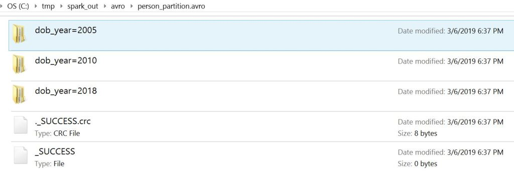

Using Avro Data Files From Spark SQL 2.3.x or earlier
=====================================================


**Version:** Apache Spark 2.3.x or earlier

If you are using Spark2.4 or later then please use the following URL.


[Using Avro Data Files From Spark SQL 2.4.x and
later]

On this post, we will see several examples or usages of accessing Spark
Avro file format using Spark 2.3 or earlier. Spark SQL supports loading
and saving DataFrames from and to a Avro data files by using
[spark-avro](https://github.com/databricks/spark-avro/blob/branch-4.0/README-for-old-spark-versions.md)
library. spark-avro originally developed by databricks as a open source
library which supports reading and writing data in Avro file format.


[Apache Avro](https://avro.apache.org/docs/current/) is a data
serialization system, it is mostly used in Apache Spark especially for
Kafka-based data pipelines. When Avro data is stored in a file, its
schema is stored with it, so that files may be processed later by any
program.

Continue reading:

-   **Writing to Avro Data Files**
-   **Reading from Avro Data Files**
-   **Writing Partition Data**
-   **Reading Partition data**
-   **Using Avro Schema**
-   **Using Spark SQL**
-   **Writing Compressed Data Files**

Accessing Avro file format in Spark is enabled by using below Maven
dependencies.


```
<dependency>
     <groupId>org.apache.spark</groupId>
     <artifactId>spark-sql_2.11</artifactId>
     <version>2.3.0</version>
</dependency>
```

```
<dependency>
    <groupId>com.databricks</groupId>
    <artifactId>spark-avro_2.11</artifactId>
    <version>4.0.0</version>
</dependency>
```

The spark-avro library includes `avro` method for reading and writing
Avro files, but this is only available with import
`import com.databricks.spark.avro._ `

#### 1. Writing Avro Data File

```
import com.databricks.spark.avro._
df.write.avro("person.avro")
```


Alternatively you can also specify by using `format`.

```
df.write.format("com.databricks.spark.avro")
  .save("person.avro")
```


#### 2. Reading Avro Data File

```
import com.databricks.spark.avro._
val readDF = spark.read.avro("person.avro")
```


Alternatively you can also specify by using `format`.

```
val readDF = spark.read
      .format("com.databricks.spark.avro")
      .load("person.avro")
```


#### 3. Writing Partition Data

Let's see how to write and read partitioned data. Partition improves
performance on reading by reducing Disk I/O.

```
val data = Seq(("James ","","Smith",2018,1,"M",3000),
      ("Michael ","Rose","",2010,3,"M",4000),
      ("Robert ","","Williams",2010,3,"M",4000),
      ("Maria ","Anne","Jones",2005,5,"F",4000),
      ("Jen","Mary","Brown",2010,7,"",-1)
    )

val columns = Seq("firstname", "middlename", "lastname", "dob_year",
 "dob_month", "gender", "salary")
import spark.sqlContext.implicits._
val df = data.toDF(columns:_*)

df.write.partitionBy("dob_year","dob_month")
        .avro("person_partition.avro")
```


creates partition by date of birth year and month on person data .



#### 4. Reading Partition Data

```
spark.read
      .avro("person_partition.avro")
      .where(col("dob_year") === 2010)
      .show()
```


Filtering on partition data just retrieves the specific partition
instead of reading entire file and then filtering. This reduces disk I/O
and improves performance on read.

#### 5. Using Avro Schema

Define avro schema in person.avsc file.


```
{
  "type": "record",
  "name": "Person",
  "namespace": "com.sparkbyexamples",
  "fields": [
    {"name": "firstname","type": "string"},
    {"name": "middlename","type": "string"},
    {"name": "lastname","type": "string"},
    {"name": "dob_year","type": "int"},
    {"name": "dob_month","type": "int"},
    {"name": "gender","type": "string"},
    {"name": "salary","type": "int"}
  ]
}
```


Specify this schema using `option` while reading Avro file. You can
download Avro schema example from
[GitHub](https://github.com/sparkbyexamples/spark-examples/blob/master/spark2.3-avro-examples/src/main/scala/com/sparkbyexamples/spark/dataframe/avro/AvroUsingDataBricks.scala)

```
val schemaAvro = new Schema.Parser()
      .parse(new File("src/main/resources/person.avsc"))

val df = spark.read
              .format("com.databricks.spark.avro")
              .option("avroSchema", schemaAvro.toString)
              .load("person.avro")
```


Alternatively we can also specify "StructType" schema using `schema`
method.

#### 6. Using Spark SQL

We can also read an Avro data files using Spark SQL. To do this, first
create a temporary table by pointing to Avro data file and run SQL
command on this table.

```
spark.sqlContext.sql("CREATE TEMPORARY VIEW PERSON USING com.databricks.spark.avro OPTIONS (path \"person.avro\")")
spark.sqlContext.sql("SELECT * FROM PERSON").show()
```


The complete Spark Avro Example using spark-avro library can be
downloaded from
[GitHub](https://github.com/sparkbyexamples/spark-examples/blob/master/spark2.3-avro-examples/src/main/scala/com/sparkbyexamples/spark/dataframe/avro/AvroUsingDataBricks.scala)

#### **Conclusion:**

We have seen examples on how to write an Avro data files and how to read
an Avro data files using Spark. Also, explained usage of Avro schema and
working with Avro partition; Using Partition we can achieve the
significant performance on read.
