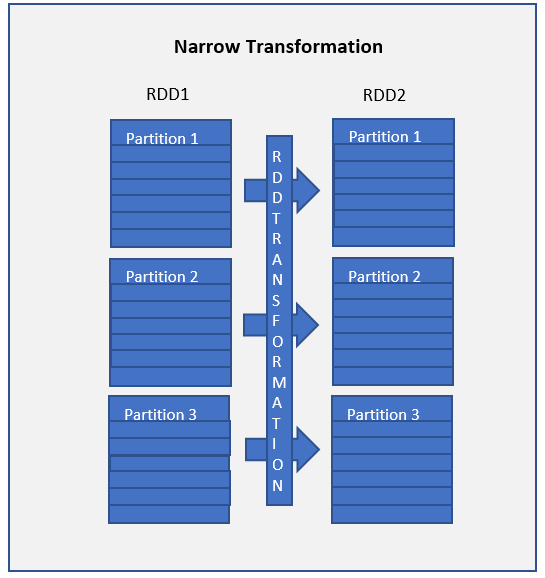
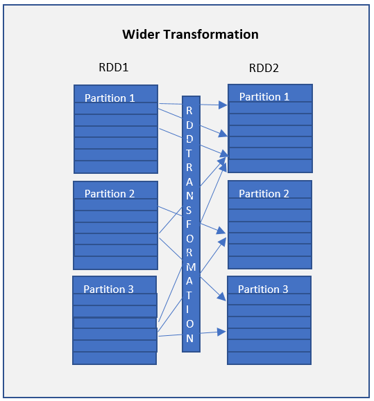
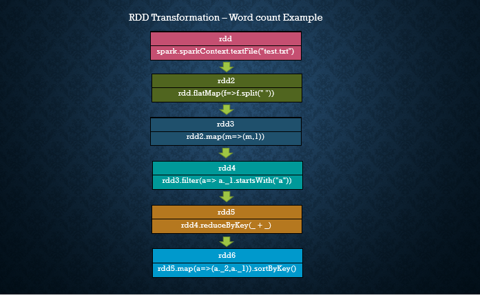

Spark RDD Transformations with examples
=======================================


RDD Transformations are Spark operations when executed on RDD, it
results in a single or multiple new RDD's. Since RDD are immutable in
nature, transformations always create new RDD without updating an
existing one hence, this creates an **RDD lineage**.


*RDD Lineage is also known as the RDD operator graph or RDD dependency
graph*.


In this tutorial, you will learn lazy transformations, types of
transformations, a complete list of transformation functions using
wordcount example in scala.


RDD Transformations are Lazy
----------------------------

RDD Transformations are lazy operations meaning none of the
transformations get executed until you call an action on Spark RDD.
Since RDD's are immutable, any transformations on it result in a new RDD
leaving the current one unchanged.


RDD Transformation Types
------------------------

There are two types are transformations.

### Narrow Transformation

Narrow transformations are the result of
[map()]
and
[filter()]
functions and these compute data that live on a single partition meaning
there will not be any data movement between partitions to execute narrow
transformations.



Functions such as `map()`, `mapPartition()`, `flatMap()`, `filter()`,
`union()` are some examples of narrow transformation


### Wider Transformation

Wider transformations are the result of
*[groupByKey()]* and *[reduceByKey()]*
functions and these compute data that live on many partitions meaning
there will be data movements between partitions to execute wider
transformations. Since these shuffles the data, they also called shuffle
transformations.



Functions such as `groupByKey()`, `aggregateByKey()`, `aggregate()`,
`join()`, `repartition()` are some examples of a wider transformations.

**Note:** When compared to Narrow transformations, wider transformations
are expensive operations due to shuffling.


Spark RDD Transformations with Examples
---------------------------------------

In this section, I will explain a few RDD Transformations with word
count example in scala, before we start first, let's [create an RDD by
reading a text
file].
The text file used here is available at the
[GitHub](https://github.com/fenago/spark-scala-examples/blob/master/src/main/resources/test.txt)
and, the scala example is available at [GitHub
project](https://github.com/fenago/spark-scala-examples/blob/master/src/main/scala/com/sparkbyexamples/spark/rdd/WordCountExample.scala)
for reference.

```
val spark:SparkSession = SparkSession.builder()
      .master("local[3]")
      .appName("sparkexamples")
      .getOrCreate()

val sc = spark.sparkContext

val rdd:RDD[String] = sc.textFile("src/main/scala/test.txt")
```




flatMap() Transformation
------------------------

`flatMap()` transformation flattens the RDD after applying the function
and returns a new RDD. On the below example, first, it splits each
record by space in an RDD and finally flattens it. Resulting RDD
consists of a single word on each record.

```
val rdd2 = rdd.flatMap(f=>f.split(" "))
```


### map() Transformation

`map()` transformation is used the apply any complex operations like
adding a column, updating a column e.t.c, the output of map
transformations would always have the same number of records as input.

In our word count example, we are adding a new column with value 1 for
each word, the result of the RDD is PairRDDFunctions which contains
key-value pairs, word of type String as Key and 1 of type Int as value.
For your understanding, I've defined rdd3 variable with type.

```
val rdd3:RDD[(String,Int)]= rdd2.map(m=>(m,1))
```


#### filter() Transformation

`filter()` transformation is used to filter the records in an RDD. In
our example we are filtering all words starts with "a".

```
val rdd4 = rdd3.filter(a=> a._1.startsWith("a"))
```


### reduceByKey() Transformation

`reduceByKey()` merges the values for each key with the function
specified. In our example, it reduces the word string by applying the
sum function on value. The result of our RDD contains unique words and
their count. 

```
val rdd5 = rdd3.reduceByKey(_ + _)
```


#### sortByKey() Transformation

`sortByKey()` transformation is used to sort RDD elements on key. In our
example, first, we convert RDD\[(String,Int\]) to RDD\[(Int,String\])
using map transformation and apply sortByKey which ideally does sort on
an integer value. And finally, foreach with println statement prints all
words in RDD and their count as key-value pair to console.

```
val rdd6 = rdd5.map(a=>(a._2,a._1)).sortByKey()

//Print rdd6 result to console
rdd6.foreach(println)
```


Spark RDD Transformations complete example
------------------------------------------

```
package com.sparkbyexamples.spark.rdd

import org.apache.spark.rdd.RDD
import org.apache.spark.sql.SparkSession

object WordCountExample {

  def main(args:Array[String]): Unit = {

    val spark:SparkSession = SparkSession.builder()
      .master("local[3]")
      .appName("sparkexamples")
      .getOrCreate()

    val sc = spark.sparkContext

    val rdd:RDD[String] = sc.textFile("src/main/resources/test.txt")
    println("initial partition count:"+rdd.getNumPartitions)

    val reparRdd = rdd.repartition(4)
    println("re-partition count:"+reparRdd.getNumPartitions)

    //rdd.coalesce(3)

    rdd.collect().foreach(println)

    // rdd flatMap transformation
    val rdd2 = rdd.flatMap(f=>f.split(" "))
    rdd2.foreach(f=>println(f))

    //Create a Tuple by adding 1 to each word
    val rdd3:RDD[(String,Int)]= rdd2.map(m=>(m,1))
    rdd3.foreach(println)

    //Filter transformation
    val rdd4 = rdd3.filter(a=> a._1.startsWith("a"))
    rdd4.foreach(println)

    //ReduceBy transformation
    val rdd5 = rdd3.reduceByKey(_ + _)
    rdd5.foreach(println)

    //Swap word,count and sortByKey transformation
    val rdd6 = rdd5.map(a=>(a._2,a._1)).sortByKey()
    println("Final Result")

    //Action - foreach
    rdd6.foreach(println)

    //Action - count
    println("Count : "+rdd6.count())

    //Action - first
    val firstRec = rdd6.first()
    println("First Record : "+firstRec._1 + ","+ firstRec._2)

    //Action - max
    val datMax = rdd6.max()
    println("Max Record : "+datMax._1 + ","+ datMax._2)

    //Action - reduce
    val totalWordCount = rdd6.reduce((a,b) => (a._1+b._1,a._2))
    println("dataReduce Record : "+totalWordCount._1)
    //Action - take
    val data3 = rdd6.take(3)
    data3.foreach(f=>{
      println("data3 Key:"+ f._1 +", Value:"+f._2)
    })

    //Action - collect
    val data = rdd6.collect()
    data.foreach(f=>{
      println("Key:"+ f._1 +", Value:"+f._2)
    })

    //Action - saveAsTextFile
    rdd5.saveAsTextFile("/headless/tmp/wordCount")
    
  }
}
```


#### Conclusion

In this Spark RDD Transformations tutorial, you have learned different
transformation functions and their usage with scala examples and GitHub
project for quick reference.

